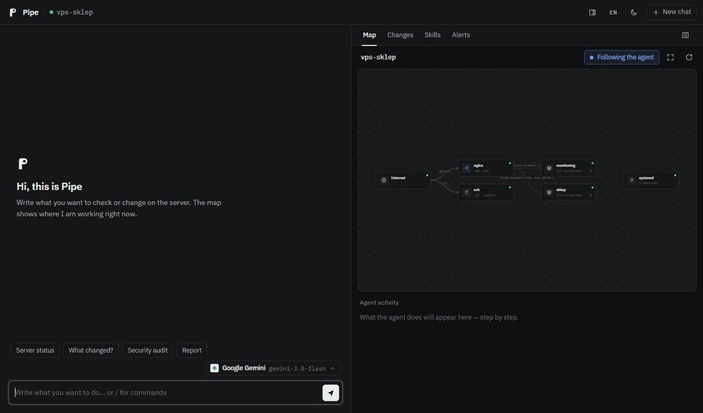

<p align="center">
  
</p>

<h1 align="center">Pipe</h1>

<p align="center">
  An AI agent that runs on your Linux server. It watches the server, messages you when something breaks,<br>
  and makes every change only after you say yes, with a backup and a way to undo it.
</p>

<p align="center">
  
  <a href="https://github.com/Kvmyk/pipe/actions/workflows/ci.yml"></a>
  <a href="./LICENSE"></a>
</p>

<p align="center">
  <a href="./README.md">Polski</a> · <b>English</b> ·
  <a href="https://kvmyk.github.io/pipe/en/">Website</a> ·
  <a href="#installation">Installation</a> ·
  <a href="docs/">Documentation (Polish)</a>
</p>

<p align="center">
  
  <br>
  <sub><code>pipe web</code> recorded from a scripted session (<a href="scripts/demo">scripts/demo</a>).</sub>
</p>

## What it is

You install Pipe on a server and leave it there. You talk to it from a terminal, a browser or Telegram, in English
or Polish. Ask it to diagnose something ("why is the shop slow?"), change something ("raise the PHP memory limit")
or explain something ("what changed since yesterday?").

Pipe keeps working between conversations. Every two minutes it checks disks, memory, load, containers and ports
open to the internet. Every hour it records the state of the server, so it knows what changed and when. When
something is wrong it sends an alert to Telegram, and every morning a short report.

The agent can read the server freely, but it changes nothing without asking. Every command goes through a
classifier written in code (not in the prompt): reads run right away, changes wait for your confirmation, and
destructive operations are always refused.

Pipe works with any model that speaks the OpenAI API. The default is Google Gemini, which has a free tier.

## Examples

| You write | Pipe |
|---|---|
| *the site went down overnight, what changed?* | goes through the change history (packages, container images, ports, configs) and points at what changed right before the outage |
| *show me the server architecture* | draws a diagram: domains, reverse proxy, containers, databases, ports exposed to the internet |
| *how secure is this server?* | scores it 0–100 and gives a ready fix for every finding; *"fix 1"* applies it with a backup |
| *every day at 7 check backups and certificates* | sets up a routine and messages you on Telegram only when something is off |
| *check the disks on all servers* | sends parallel helpers (workers) to remote machines over SSH |
| *is our PostgreSQL still supported?* | reads the version on the server and checks it against endoflife.date |
| *undo the last change* | restores the files from the backup taken before the change |
| *why is this broken?* + a screenshot or a log | looks at the screenshot, reads the log (secrets hidden from the model) and looks for the cause on the server |

## What it does

**Watches the server on its own.** The two-minute checks run without a language model, so they cost nothing.
Pipe finds domains in the nginx, Caddy and Traefik configuration by itself and watches certificate expiry, site
responses and DNS. It notices new accounts, SSH keys and suspicious logins. It also accepts alerts from
Alertmanager, Grafana, Uptime Kuma and GitHub and starts looking into the cause right away.

**Changes things carefully.** Before every approved change it backs up the files. It validates configuration before
reloading (`nginx -t`, `sshd -t`, `docker compose config`) and afterwards checks that the service runs and the sites
still respond. If they don't, it restores the previous version by itself. Everything goes into a journal and can be
undone with `/undo`.

**Remembers the server.** It keeps facts about the server in `SERVER.md`, a map of where repositories, applications
and backups live, and proven procedures as skills. It also remembers resolved incidents: when a problem comes back,
it starts from what helped last time.

**Manages several machines.** Remote servers (SSH), containers and Kubernetes clusters are added as targets. Nothing
is installed on the other side. Workers investigate targets in parallel and only read; changes come back to you as
proposals.

**Searches the web when it doesn't know something.** An unknown error message, a new version, a CVE: Pipe searches
the web (DuckDuckGo, Stack Exchange, Wikipedia) and cites its sources. No API key needed.

**Works with other agents.** Claude Code, Cursor or your own agent can work on the server through Pipe (MCP). Reads
run right away, and every change waits for your approval on Telegram.

## Installation

On the server (Docker; the wizard asks for the model provider and API key):

```bash
git clone https://github.com/Kvmyk/pipe && cd pipe
sudo bash scripts/install-server.sh --lang en
```

Without Docker: `sudo bash scripts/install-server.sh --mode native --lang en`. No API key? Pick Google Gemini and
create a free key at [aistudio.google.com/apikey](https://aistudio.google.com/apikey).

On your own computer install the client and type `pipe`. It connects to the server through an SSH tunnel:

```bash
bash install.sh          # Linux and macOS
.\install.ps1            # Windows (PowerShell)
```

`pipe web` opens the browser version, with a map of the server that shows where the agent is working. No extra port
is opened on the server.

Telegram (recommended, alerts arrive there): fill in `clients/telegram/.env` (bot token and your user id) and run the
installer again. Language: `PIPE_LANG=en` in `backend/.env` and `clients/telegram/.env`, `pipe --lang en` in the CLI,
or `/language en` at runtime.

Other ways to deploy (native with systemd, Kubernetes, cloud-init) are described in
[docs/deploy.md](./docs/deploy.md).

## Security

- The classifier lets only recognised reads through without asking. An unknown command means a confirmation prompt.
- The confirmation shows exactly the command that will run, together with the backup and verification plan.
- API keys, passwords and tokens from files are hidden before any text reaches the model provider.
- Workers and routines only read. Every operation is written to an audit log.

An important limitation: in Docker mode Pipe has access to `docker.sock`, which in practice means root on the server.
The protection is your confirmation of every change. Full description: [docs/security.md](./docs/security.md).

## Documentation

The detailed documentation is in Polish; the commands, configuration names and examples read the same in both
languages.

| | |
|---|---|
| [Quick start](./docs/quickstart.md) | installation step by step |
| [Features](./docs/features.md) | watching, workers, routines, diagrams, `pipe web`, MCP |
| [Deployment](./docs/deploy.md) | Docker, systemd, Kubernetes, clouds |
| [Backend](./docs/backend.md) | configuration, `.env` variables, agent tools |
| [CLI](./docs/cli.md) and [Telegram](./docs/telegram.md) | clients and commands |
| [Security](./docs/security.md) | classifier, confirmations, limitations |
| [Protocol](./docs/protocol.md) | how clients talk to the backend |
| [Changelog](./docs/changelog.md) | what changed in each version |

## License

MIT, see [LICENSE](./LICENSE). Bug reports and pull requests are welcome.

<sub>LLM provider logos in `pipe web` are trademarks of their owners and only indicate whose models the agent connects
to; Pipe is not affiliated with these companies (`clients/webui/static/providers/NOTICE.md`). IBM Plex Sans and IBM
Plex Mono typefaces: SIL Open Font License 1.1 (`clients/webui/static/fonts/OFL.txt`).</sub>
