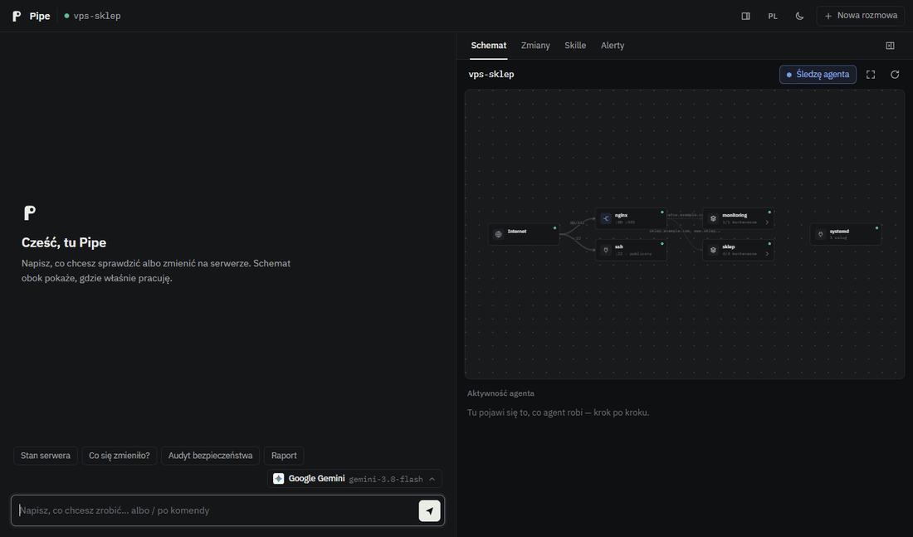

<p align="center">
  
</p>

<h1 align="center">Pipe</h1>

<p align="center">
  Agent AI, który działa na Twoim serwerze Linux. Pilnuje go, sam pisze, gdy coś się psuje,<br>
  a każdą zmianę robi dopiero po Twoim „tak”, z kopią zapasową i możliwością cofnięcia.
</p>

<p align="center">
  
  <a href="https://github.com/Kvmyk/pipe/actions/workflows/ci.yml"></a>
  <a href="./LICENSE"></a>
</p>

<p align="center">
  <b>Polski</b> · <a href="./README.en.md">English</a> ·
  <a href="https://kvmyk.github.io/pipe/">Strona projektu</a> ·
  <a href="#instalacja">Instalacja</a> ·
  <a href="docs/">Dokumentacja</a>
</p>

<p align="center">
  
  <br>
  <sub>Nagranie <code>pipe web</code> z zaplanowanej sesji (<a href="scripts/demo">scripts/demo</a>).</sub>
</p>

## Co to jest

Pipe instalujesz na serwerze i zostawiasz go tam na stałe. Rozmawiasz z nim z terminala, z przeglądarki albo
z Telegrama, po polsku lub po angielsku. Możesz poprosić o diagnozę („czemu sklep działa wolno?”), o zmianę
(„podnieś limit pamięci PHP”) albo o wyjaśnienie („co się zmieniło od wczoraj?”).

Pipe pracuje także między rozmowami. Co dwie minuty sprawdza dyski, pamięć, obciążenie, kontenery i porty otwarte na
świat. Co godzinę zapisuje stan serwera, więc wie, co i kiedy się zmieniło. Gdy coś jest nie tak, wysyła alert
na Telegram, a rano krótki raport.

Agent może czytać serwer swobodnie, ale niczego nie zmienia bez pytania. Każda komenda przechodzi przez
klasyfikator zapisany w kodzie (nie w prompcie): odczyty wykonują się od razu, zmiany czekają na Twoje
potwierdzenie, a operacje niszczące są odrzucane zawsze.

Pipe działa z dowolnym modelem zgodnym z API OpenAI. Domyślnie z Google Gemini, który ma darmowy limit.

## Przykłady

Tak wyglądają typowe prośby:

| Piszesz | Pipe |
|---|---|
| *strona padła w nocy, co się zmieniło?* | przegląda historię zmian (pakiety, obrazy kontenerów, porty, konfiguracje) i wskazuje, co zmieniło się tuż przed awarią |
| *pokaż architekturę serwera* | rysuje diagram: domeny, reverse proxy, kontenery, bazy, porty wystawione na świat |
| *jak bezpieczny jest ten serwer?* | ocenia go w skali 0–100 i do każdej uwagi daje gotową poprawkę; *„napraw 1”* wykonuje ją z kopią |
| *codziennie o 7 sprawdzaj backupy i certyfikaty* | zakłada rutynę i pisze na Telegram tylko wtedy, gdy coś jest nie tak |
| *sprawdź dyski na wszystkich serwerach* | wysyła równoległych pomocników (workerów) na zdalne maszyny przez SSH |
| *czy nasz PostgreSQL jest jeszcze wspierany?* | sprawdza wersję na serwerze i porównuje z endoflife.date |
| *cofnij ostatnią zmianę* | przywraca pliki z kopii zrobionej przed zmianą |
| *czemu to nie działa?* + zrzut ekranu albo log | ogląda zrzut, czyta log (sekrety ukrywa przed modelem) i szuka przyczyny na serwerze |

Pełna lista funkcji z przykładami: [docs/features.md](./docs/features.md).

## Dla Claude Code, Codexa i innych agentów

Jeśli pracujesz już z agentem w terminalu, nie musisz dawać mu SSH do produkcji. Podłącz go do Pipe przez MCP.
Agent dostaje narzędzie `run_command`, które przechodzi przez ten sam klasyfikator co rozmowa z Pipe. Odczyty
wykonują się od razu, zakazane komendy są odrzucane, a każda zmiana czeka na Twoją zgodę na Telegramie (w CLI:
`/zgody`). Po zgodzie Pipe robi kopię plików, sprawdza konfigurację przed przeładowaniem i po nim, a gdy coś
przestaje działać, przywraca poprzednią wersję. Każda zmiana trafia do dziennika i można ją cofnąć.

Agent dostaje też to, co Pipe wie o serwerze: historię zmian, mapę usług, wyniki sprawdzeń i audytu.

Na serwerze utwórz osobny token dla agenta, a na swoim komputerze dodaj Pipe jako serwer MCP:

```bash
python3 -m backend.tokens add claude-code --role admin                 # na serwerze, w katalogu Pipe
claude mcp add pipe -e AGENT_TOKEN=<token> -- pipe --mcp --host root@serwer   # Claude Code na laptopie
```

Inne programy (Codex, Cursor, własny agent) dostają to samo polecenie: `pipe --mcp --host root@serwer`
ze zmienną `AGENT_TOKEN`. Pipe nie potrzebuje do tego własnego modelu: przy `LLM_PROVIDER=none` myśli Twój agent,
a Pipe pilnuje tego, co się wykonuje. Szczegóły: [docs/features.md](./docs/features.md) (sekcja MCP).

## Co potrafi

**Pilnuje serwera bez Twojego udziału.** Sprawdzenia co dwie minuty działają bez modelu językowego, więc nic nie
kosztują. Pipe sam znajduje domeny w konfiguracji nginx, Caddy i Traefika, a potem pilnuje ważności certyfikatów,
odpowiedzi stron i DNS. Wykrywa nowe konta, klucze SSH i podejrzane logowania. Przyjmuje też alerty z Alertmanagera,
Grafany, Uptime Kuma i GitHuba i od razu bada ich przyczynę.

**Zmienia ostrożnie.** Przed każdą zatwierdzoną zmianą robi kopię plików. Konfigurację sprawdza przed
przeładowaniem (`nginx -t`, `sshd -t`, `docker compose config`), a po zmianie upewnia się, że usługa działa i strony
dalej odpowiadają. Jeśli nie odpowiadają, sam przywraca poprzednią wersję. Wszystko trafia do dziennika i można to
cofnąć komendą `/cofnij`.

**Pamięta serwer.** W `SERVER.md` zapisuje fakty o serwerze, w mapie katalogów zapisuje, gdzie leżą repozytoria,
aplikacje i backupy, a sprawdzone procedury zapisuje jako skille. Pamięta też rozwiązane incydenty: gdy problem
wraca, zaczyna od tego, co pomogło poprzednio.

**Zarządza kilkoma maszynami.** Zdalne serwery (SSH), kontenery i klastry Kubernetes dodajesz jako cele. Na drugiej
stronie nic nie trzeba instalować. Pomocnicy (workery) badają cele równolegle i tylko czytają; zmiany wracają do
Ciebie jako propozycje.

**Szuka w internecie, gdy czegoś nie wie.** Nieznany komunikat błędu, nowa wersja, CVE: Pipe sam przeszukuje sieć
(DuckDuckGo, Stack Exchange, Wikipedia) i podaje źródła. Nie potrzeba do tego żadnego klucza API.

**Współpracuje z innymi agentami.** Claude Code, Cursor albo Twój własny agent mogą pracować na serwerze przez
Pipe (MCP). Odczyty wykonują się od razu, a każda zmiana czeka na Twoją zgodę na Telegramie
([wyżej](#dla-claude-code-codexa-i-innych-agentów)).

## Instalacja

Na serwerze (Docker; kreator zapyta o providera modelu i klucz API):

```bash
git clone https://github.com/Kvmyk/pipe && cd pipe
sudo bash scripts/install-server.sh
```

Instalator pobiera gotowy obraz z ghcr.io, podpisany przy wydaniu (z `--build` zbuduje go na serwerze ze źródeł).
Bez Dockera: `sudo bash scripts/install-server.sh --mode native`.

Nie masz klucza API? Wybierz Google Gemini, darmowy klucz wygenerujesz na
[aistudio.google.com/apikey](https://aistudio.google.com/apikey). W darmowym planie Google może jednak uczyć się
na Twoich zapytaniach, a te zawierają logi i konfigurację serwera, więc na produkcji włącz płatności albo wybierz
innego dostawcę. Możesz też wybrać „Bez modelu”: Pipe pilnuje serwera, wysyła alerty i raporty, działa jako bramka
MCP i nic nie wysyła na zewnątrz. Rozmowę włączysz później, dodając dostawcę.

Na swoim komputerze zainstaluj klienta i wpisz `pipe`. Klient łączy się z serwerem przez tunel SSH:

```bash
bash install.sh          # Linux i macOS
.\install.ps1            # Windows (PowerShell)
```

Komenda `pipe web` otwiera wersję w przeglądarce, ze schematem serwera, na którym widać, gdzie agent właśnie
pracuje. Na serwerze nie otwiera się żaden dodatkowy port.

Telegram (polecany, bo tam przychodzą alerty): uzupełnij `clients/telegram/.env` (token bota i swój identyfikator)
i uruchom instalator jeszcze raz. Szczegóły: [docs/telegram.md](./docs/telegram.md).

Inne sposoby wdrożenia (natywnie z systemd, Kubernetes, cloud-init): [docs/deploy.md](./docs/deploy.md).

Chcesz najpierw zobaczyć, jak to działa, bez własnego serwera? `python3 sandbox/run.py try --scenario nginx-502`
uruchamia na Twoim komputerze kontener udający serwer z zepsutym nginx, a w nim Pipe. Te same scenariusze służą do
sprawdzania, które modele radzą sobie z naprawami: [sandbox/README.md](./sandbox/README.md).

## Bezpieczeństwo

- Klasyfikator przepuszcza bez pytania tylko rozpoznane odczyty. Nieznana komenda oznacza pytanie o zgodę.
- Okno potwierdzenia pokazuje dokładnie tę komendę, która się wykona, razem z planem kopii i weryfikacji.
- Klucze API, hasła i tokeny z plików są ukrywane, zanim tekst trafi do dostawcy modelu.
- Workery i rutyny tylko czytają. Każda operacja jest zapisywana w dzienniku audytu.

Ważne ograniczenie: w trybie Docker Pipe ma dostęp do `docker.sock`, czyli w praktyce uprawnienia roota na serwerze.
Ochroną jest Twoje potwierdzenie przy każdej zmianie. Pełny opis: [docs/security.md](./docs/security.md).

Jeśli wolisz zacząć ostrożnie, zainstaluj Pipe z `--profile observe`. Wtedy nie dostaje `docker.sock` (Dockera
widzi tylko do odczytu), `/root` jest tylko do odczytu, a każda zmiana jest odrzucana bez pytania. Pipe dalej
pilnuje serwera, odpowiada na pytania i wysyła alerty. Pełny tryb włączysz później przez `--profile full`.

Znalazłeś podatność? Zgłoś ją prywatnie, nie w publicznym issue: [SECURITY.md](./SECURITY.md).
Chcesz pomóc w inny sposób? Zobacz [CONTRIBUTING.md](./CONTRIBUTING.md).

## Dokumentacja

Ta sama dokumentacja jest na stronie projektu: [kvmyk.github.io/pipe/docs](https://kvmyk.github.io/pipe/docs/).

| | |
|---|---|
| [Szybki start](./docs/quickstart.md) | instalacja krok po kroku |
| [Funkcje](./docs/features.md) | czuwanie, workery, rutyny, diagramy, `pipe web`, MCP |
| [Wdrożenie](./docs/deploy.md) | Docker, systemd, Kubernetes, chmury |
| [Backend](./docs/backend.md) | konfiguracja, zmienne `.env`, narzędzia agenta |
| [CLI](./docs/cli.md) i [Telegram](./docs/telegram.md) | klienci i komendy |
| [Bezpieczeństwo](./docs/security.md) | klasyfikator, potwierdzenia, ograniczenia |
| [Protokół](./docs/protocol.md) | format komunikacji klientów z backendem |
| [Historia zmian](./docs/changelog.md) | co się zmieniło w kolejnych wersjach |

## Licencja

MIT, zobacz [LICENSE](./LICENSE). Zgłoszenia błędów i pull requesty są mile widziane.

<sub>Logotypy dostawców modeli w `pipe web` są znakami towarowymi ich właścicieli i wskazują tylko, z czyimi modelami
łączy się agent; Pipe nie jest z tymi firmami powiązany (`clients/webui/static/providers/NOTICE.md`). Kroje IBM Plex
Sans i IBM Plex Mono: SIL Open Font License 1.1 (`clients/webui/static/fonts/OFL.txt`).</sub>
